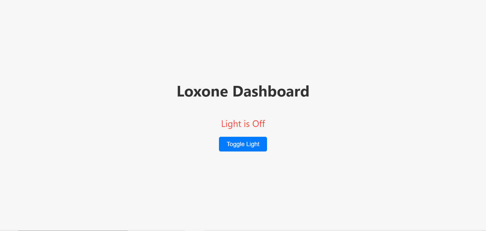
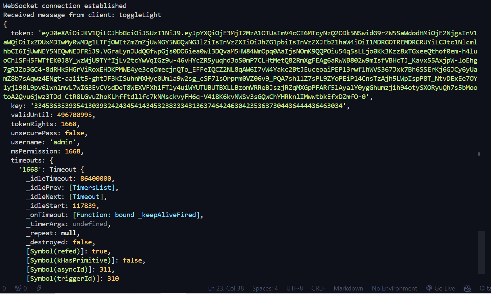

`

`


# Loxone Light Control Dashboard

A web-based dashboard to control and monitor lights using Loxone Miniserver.

## Features

- Real-time light status updates
- Toggle light on/off
- WebSocket communication with Loxone Miniserver

## Installation

Follow these steps to set up the project locally:

```bash
# Clone the repository
git clone https://github.com/Am10aN16/loxone-light-dashboard.git

# Navigate to the project directory
cd loxone-light-dashboard

# Install server dependencies
npm install

# Navigate to the client directory
cd client

# Install client dependencies
npm install

# Navigate back to the project root
cd ..

# Start the server
npm start

# Open another terminal window and navigate to the client directory
cd client

# Start the client
npm start
